# Dual Generator System Architecture

**Type:** Architecture Diagram
**Last Updated:** 2025-11-07
**Related Files:**
- `src/index.ts` (website page generator)
- `src/component.ts` (component variation generator)
- `src/prompt-templates.ts` (shared prompt building utilities)
- `package.json`

## Purpose

Shows how sketch-cli provides two complementary design generation tools - website page mockups and component variations - sharing common infrastructure while serving different design exploration needs.

## Diagram

```mermaid
graph TB
    subgraph "User Entry Points"
        A1[bun run sketch<br/>Website Page Generator]
        A2[bun run component<br/>Component Variation Generator]
    end

    subgraph "Website Generator Flow (src/index.ts)"
        B1[Parse Args or<br/>Interactive Mode]
        B2[Website Type<br/>Page Type<br/>Tuning/Platform]
        B3[buildPrompt]
        B4[7 Page Types<br/>15 Tuning Presets<br/>10 Platform Presets]
    end

    subgraph "Component Generator Flow (src/component.ts)"
        C1[Parse Args or<br/>Interactive Mode]
        C2[Reference Image<br/>Component Type<br/>Style/Palette]
        C3[buildComponentPrompt]
        C4[15 Component Types<br/>20 Style Presets<br/>20 Color Palettes]
    end

    subgraph "Shared Infrastructure"
        D1[Argument Parsing Pattern] -->|"Reused approach"| D2[Interactive Mode Pattern]
        D2 -->|"@inquirer/prompts"| D3[User Input Collection]
        D3 -->|"Shows equivalent<br/>CLI command"| D4[CLI Teaching Pattern]

        E1[Preset System Architecture] -->|"Typed objects with<br/>'as const'"| E2[Preset Lookup Functions]
        E2 -->|"Preset or custom<br/>string fallback"| E3[Flexible Input Handling]

        F1[File Naming Convention] -->|"Descriptive slugs +<br/>timestamp"| F2[Organized Output]
        F2 -->|"Unique identifiers"| F3[Gemini File Generation]

        G1[Dry Run Mode] -->|"Preview prompts"| G2[Prompt Display]
        G2 -->|"Execute mode"| G3[Gemini CLI Execution]
    end

    subgraph "External Integration"
        H1[Gemini CLI<br/>--yolo mode]
        H2[nanobanana /generate]
        H3[File System Storage]
    end

    subgraph "User Outcomes"
        I1[Website Page Mockups<br/>Multiple layout variations]
        I2[Component Design Variations<br/>Multiple style explorations]
        I3[Design Decision Making<br/>Informed by visual options]
    end

    A1 -->|"Website design<br/>exploration"| B1
    A2 -->|"Component iteration<br/>from reference"| C1

    B1 --> B2
    B2 --> B3
    B3 --> B4
    B4 --> D1

    C1 --> C2
    C2 --> C3
    C3 --> C4
    C4 --> D1

    D4 --> E1
    E3 --> F1
    F3 --> G1
    G3 --> H1

    H1 --> H2
    H2 --> H3

    H3 -->|"Website images"| I1
    H3 -->|"Component images"| I2

    I1 --> I3
    I2 --> I3

    I3 -.->|"Iterate on website"| A1
    I3 -.->|"Iterate on component"| A2

    style A1 fill:#E3F2FD
    style A2 fill:#E3F2FD
    style I1 fill:#E8F5E9
    style I2 fill:#E8F5E9
    style I3 fill:#E8F5E9
    style D1 fill:#FFF3E0
    style E1 fill:#FFF3E0
    style F1 fill:#FFF3E0
    style G1 fill:#FFF3E0
    style H1 fill:#FCE4EC

    classDef userEntry fill:#E3F2FD,stroke:#2196F3,stroke-width:2px
    classDef outcome fill:#E8F5E9,stroke:#4CAF50,stroke-width:2px
    classDef shared fill:#FFF3E0,stroke:#FF9800,stroke-width:2px
    classDef external fill:#FCE4EC,stroke:#E91E63,stroke-width:2px
```

## Key Insights

**Dual Purpose Architecture:**
- **Website generator** creates full page mockups from text descriptions
- **Component generator** creates variations from reference images
- **Complementary workflows** cover both macro (pages) and micro (components) design
- **Shared patterns** reduce code duplication and maintain consistency
- **Independent execution** allows using either tool without the other

**User Impact:**
- **Two distinct entry points** for different design tasks:
  - `bun run sketch` for exploring website page designs
  - `bun run component` for iterating on specific components
- **Consistent UX** across both tools (interactive vs direct modes, dry run, etc.)
- **Complete design toolkit** from initial page concepts to refined component details
- **Workflow flexibility** supports both top-down (pages first) and bottom-up (components first) design

**Shared Infrastructure Benefits:**
1. **Argument Parsing Pattern**
   - Both tools support interactive and direct CLI modes
   - Consistent flag naming (--dry-run, --help, --list-*)
   - Equivalent command display after interactive mode

2. **Preset System Architecture**
   - Typed objects with `as const` for type safety
   - Lookup functions that handle preset keys or custom strings
   - Extensible through configuration objects

3. **File Naming Convention**
   - Descriptive slugs from user inputs
   - Timestamps for chronological organization
   - Variation numbers for series tracking

4. **Gemini Integration**
   - Both use `Bun.spawn(['gemini', '--yolo', prompt])`
   - Unique identifiers prevent filename collisions
   - Consistent error handling and exit codes

**Customization Dimensions:**

Website Generator (3D matrix):
- 7 page types (home, about, product, cart, contact, sales, blog)
- 15 tuning presets (creative, minimal, vibrant, elegant, etc.)
- 10 platform presets (website, mobile, tablet, watch, tv, etc.)

Component Generator (3D matrix):
- 15 component types (button, card, form, nav, modal, etc.)
- 20 style presets (material, ios, glassmorphism, neumorphism, etc.)
- 20 color palettes (dracula, nord, tokyo-night, material, etc.)

**Technical Principles:**
- **Separation of concerns:** Each generator has dedicated entry point and prompt builder
- **Code reuse:** Shared patterns without tight coupling
- **Type safety:** TypeScript with strict typing throughout
- **ESM modules:** Modern JavaScript module system
- **Bun runtime:** Fast execution and built-in TypeScript support
- **External delegation:** Image generation handled by Gemini CLI

**Why Two Separate Tools?**
- **Different inputs:** Text descriptions vs reference images
- **Different outputs:** Full pages vs individual components
- **Different use cases:** Initial exploration vs detailed refinement
- **Clear mental model:** Users understand which tool to use when
- **Independent evolution:** Each tool can evolve without affecting the other

**Development Workflow Examples:**

Top-Down Approach:
1. Use website generator to explore page concepts
2. Select preferred page design
3. Use component generator to refine individual components
4. Apply learnings back to page designs

Bottom-Up Approach:
1. Use component generator to define component library
2. Establish consistent style and color schemes
3. Use website generator with same aesthetic direction
4. Ensure component and page designs align

**Extensibility Points:**
- Add new page types: Update PAGE_COMPONENTS
- Add new component types: Update COMPONENT_TYPES
- Add new style presets: Update TUNING_PRESETS or VARIATION_PRESETS
- Add new color palettes: Update COLOR_PALETTES
- Add new platforms: Update PLATFORM_PRESETS

**Future Integration Opportunities:**
- Color palettes could be shared with website generator
- Component type awareness could inform page component requirements
- Style presets could be cross-referenced between tools
- Generated components could be referenced in page mockups

## Change History

- **2025-11-07:** Initial diagram created showing dual generator architecture
