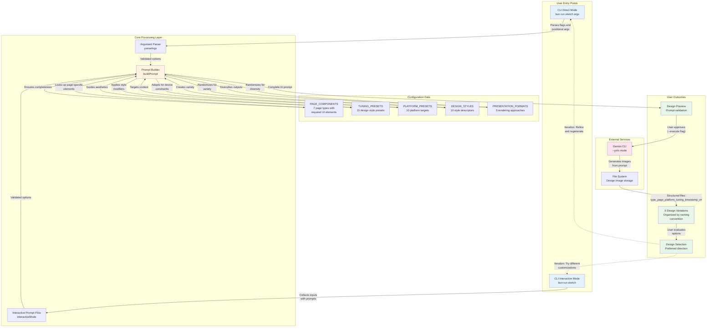

# System Architecture Overview

**Type:** Architecture Diagram
**Last Updated:** 2025-11-05
**Related Files:**
- `src/index.ts`
- `src/prompt-templates.ts`
- `src/tuning-presets.ts`
- `src/platform-presets.ts`
- `package.json`

## Purpose

Provides a high-level view of how the Website Sketch Generator system components work together to transform user intent into AI-generated design sketches, showing the value chain from user input to design output.

## Diagram

## Key Insights

**User Impact:**
- **Dual entry modes** support different user skill levels and workflow preferences
- **5 configuration datasets** provide rich customization without requiring design expertise
- **Structured output naming** enables systematic organization and comparison of design variations
- **Iterative workflow** encourages exploration and refinement of design directions
- **Preview before execution** prevents wasted AI credits on unwanted prompts

**System Architecture Principles:**
- **Separation of concerns:** Parsing, building, and execution are distinct phases
- **Data-driven design:** All customization options defined in reusable configuration objects
- **Randomization strategy:** Uses `getRandomItems()` to ensure fresh results each run
- **External dependency:** Relies on Gemini CLI being installed and accessible in PATH
- **File-based output:** Generated images saved to filesystem with descriptive names

**Configuration Extensibility:**
- New page types added via `PAGE_COMPONENTS` object
- New design presets added via `TUNING_PRESETS` object
- New platform targets added via `PLATFORM_PRESETS` object
- Custom user inputs supported via string pass-through

**External Integration Points:**
- **Gemini CLI:** Required dependency for image generation
- **Bun runtime:** Execution environment for TypeScript
- **File system:** Storage for generated design images
- **@inquirer/prompts:** Interactive user input collection

## Change History

- **2025-11-05:** Initial architecture diagram created with DDD principles
