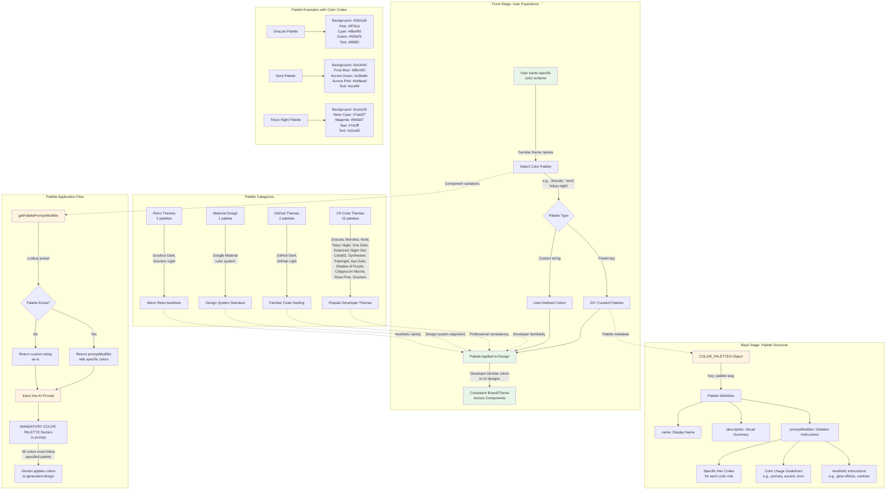

# Color Palette System

**Type:** Feature Diagram
**Last Updated:** 2025-11-07
**Related Files:**
- `src/color-palettes.ts`
- `src/component.ts`
- `src/prompt-templates.ts` (future integration for website pages)

## Purpose

Demonstrates how the color palette system enables users to apply consistent, developer-friendly color schemes to both component variations and website designs, bridging the gap between popular code editor themes and UI design.

## Diagram



## Key Insights

**User Impact:**
- **Developer-friendly themes** bring familiar VS Code color schemes into UI design work
- **20+ curated palettes** eliminate need to manually specify color codes
- **Specific hex codes included** in prompts ensure authentic color reproduction
- **Consistent theming** across multiple component variations using same palette
- **Professional color combinations** vetted by millions of developers using these themes daily
- **Dark and light options** for different design contexts (e.g., Solarized Dark/Light, Gruvbox Dark/Light)
- **Custom palette support** allows unlimited user-defined color schemes

**Palette Organization:**
- **VS Code Themes (15):** Most popular code editor themes for developer familiarity
- **GitHub Themes (2):** Professional, widely-recognized color schemes
- **Material Design (1):** Google's design system for consistency with Material UI
- **Retro Themes (2):** Warm, nostalgic color palettes for vintage aesthetics

**Technical Implementation:**
- Each palette includes:
  - **Name**: Human-readable display name
  - **Description**: Visual summary of the color scheme
  - **promptModifier**: Detailed instructions with specific hex codes for AI
- `getPalettePromptModifier()` function handles preset lookup and custom fallback
- Palette modifier injected as "MANDATORY" section in AI prompts
- AI instructed that "All colors must follow the specified palette"
- Works with both component variations and website page generation (future)

**Color Specification Format:**
```
Background: #282a36 (dark purple)
Primary: #ff79c6 (vibrant pink)
Accent: #8be9fd (cyan)
Success: #50fa7b (green)
Text: #f8f8f2 (light gray)
+ Usage guidelines for each color role
```

**Usage Patterns:**
1. **Component with palette**: `bun run component ./button.png --palette dracula`
2. **Style + palette combo**: `bun run component ./card.png --style glassmorphism --palette nord`
3. **Custom palette**: `bun run component ./form.png --palette "warm earth tones with terracotta and sage"`
4. **List palettes**: `bun run component --list-palettes`

**Why Developer Themes?**
- Developers already love and trust these color schemes
- Proven color combinations with good contrast and accessibility
- Familiar aesthetic makes designs feel comfortable to technical teams
- Easy to communicate: "Use Dracula theme" vs describing hex codes
- Strong brand recognition (Nord, Dracula, Gruvbox have dedicated followings)

**Extensibility:**
- Add new palette: Create entry in COLOR_PALETTES object
- Include specific hex codes for primary, accent, background, text, etc.
- Provide usage guidelines and aesthetic notes
- Automatically available in CLI and interactive mode

**Future Enhancement:**
- Integration with website page generator (`src/index.ts`)
- Palette combinations with tuning presets for website designs
- Palette validation and preview before generation
- Export palette as CSS variables or design tokens

## Change History

- **2025-11-07:** Initial diagram created for color palette system
