# Component Variation System

**Type:** Feature Diagram
**Last Updated:** 2025-11-07
**Related Files:**
- `src/component.ts`
- `src/component-types.ts`
- `src/variation-presets.ts`
- `src/color-palettes.ts`

## Purpose

Demonstrates how the component variation system enables designers and developers to explore multiple design directions for UI components from a reference image, using a three-dimensional customization matrix (Component Type × Style × Palette).

## Diagram

```mermaid
graph TB
    subgraph "Front-Stage: User Workflow"
        A[User provides:<br/>Reference Component Image] -->|"e.g., button.png"| B[Optional Specification:<br/>Type/Style/Palette]
        B -->|"Guides AI focus"| C[Generation Configuration:<br/>Variation Count & Mode]
        C -->|"--dry-run or execute"| D[Multiple Component Variations<br/>Generated by Gemini]
        D -->|"Side-by-side comparison<br/>enables evaluation"| E[User selects preferred<br/>design direction]
    end

    subgraph "Component Type Dimension (15 types)"
        F[Button/CTA] -->|"Focus: shape, states,<br/>icon placement"| G[Type-Specific<br/>Focus Areas]
        H[Card Component] -->|"Focus: layout, media,<br/>content hierarchy"| G
        I[Form Input] -->|"Focus: label position,<br/>validation, icons"| G
        J[Navigation Menu] -->|"Focus: layout, active states,<br/>dropdown treatment"| G
        K[Modal/Dialog] -->|"Focus: sizing, backdrop,<br/>action placement"| G
        L[+ 10 More Types:<br/>Table, List, Header,<br/>Footer, Badge, Icon,<br/>Dropdown, Toggle,<br/>Toast, Avatar] -->|"Each with unique<br/>focus areas"| G
    end

    subgraph "Style Dimension (20+ presets)"
        M[Material Design] -->|"Elevated surfaces,<br/>ripple effects"| N[Style<br/>Modifier]
        O[iOS/Apple Design] -->|"Blur effects,<br/>subtle shadows"| N
        P[Glassmorphism] -->|"Frosted glass,<br/>transparency"| N
        Q[Neumorphism] -->|"Soft shadows,<br/>embossed effects"| N
        R[Bold & Vibrant] -->|"High contrast,<br/>thick borders"| N
        S[+ 15 More Styles:<br/>Fluent, Minimal, Gradient,<br/>Neon, Brutalist, Retro,<br/>Flat, Skeuomorphic,<br/>Organic, Geometric,<br/>Elegant, Playful, etc.] -->|"Each with detailed<br/>design direction"| N
    end

    subgraph "Color Palette Dimension (20+ palettes)"
        T[Dracula] -->|"Dark purple with<br/>pink & cyan accents"| U[Palette<br/>Modifier]
        V[Nord] -->|"Arctic blues &<br/>cool grays"| U
        W[Tokyo Night] -->|"Deep purple-gray with<br/>neon cyan"| U
        X[Material] -->|"Google Material<br/>color system"| U
        Y[GitHub Dark/Light] -->|"Familiar GitHub<br/>aesthetics"| U
        Z[+ 15 More Palettes:<br/>Monokai, Solarized,<br/>One Dark, Gruvbox,<br/>Synthwave, Catppuccin,<br/>Rose Pine, etc.] -->|"Developer-friendly<br/>color schemes"| U
    end

    subgraph "Back-Stage: Prompt Construction"
        AA[buildComponentPrompt] -->|"Analyzes reference<br/>image context"| AB[Reference Image Analysis]
        AA -->|"Applies component<br/>constraints"| G
        AA -->|"Applies design<br/>direction"| N
        AA -->|"Applies color<br/>scheme"| U

        AB --> AC[Prompt Assembly]
        G --> AC
        N --> AC
        U --> AC

        AC -->|"Variation-specific<br/>unique ID"| AD[File Naming Scheme:<br/>type_style_timestamp_v#.png]
        AC -->|"Critical requirements &<br/>DO NOTs"| AE[Constraint Section]

        AD --> AF[Complete AI Prompt]
        AE --> AF
    end

    A -.->|"Visual reference<br/>for AI"| AB
    B -.->|"Optional<br/>specification"| G
    B -.->|"Optional<br/>specification"| N
    B -.->|"Optional<br/>specification"| U
    C -.->|"Iteration count"| AA
    AF -.->|"Powers variation<br/>generation"| D

    AG[Variation 1:<br/>Material + Dracula] --> E
    AH[Variation 2:<br/>iOS + Nord] --> E
    AI[Variation 3:<br/>Glassmorphism + Tokyo Night] --> E
    AJ[Variation 4:<br/>Neumorphism + Material] --> E
    AK[Variation 5:<br/>Bold + GitHub Dark] --> E

    D --> AG
    D --> AH
    D --> AI
    D --> AJ
    D --> AK

    style A fill:#E8F5E9
    style D fill:#E8F5E9
    style E fill:#E8F5E9
    style AA fill:#FFF3E0
    style AC fill:#FFF3E0
    style AF fill:#FFF3E0

    classDef userImpact fill:#E8F5E9,stroke:#4CAF50,stroke-width:2px
    classDef technical fill:#FFF3E0,stroke:#FF9800,stroke-width:2px
```

## Key Insights

**User Impact:**
- **15 component types** with type-specific focus areas ensure AI considers appropriate design factors
- **20+ style presets** from major design systems (Material, iOS, Fluent) to aesthetic trends (Glassmorphism, Neumorphism)
- **20+ color palettes** including popular developer themes (Dracula, Tokyo Night) and design systems (Material, GitHub)
- **6,000+ possible combinations** (15 types × 20 styles × 20 palettes) before considering custom inputs
- **Reference-based approach** allows iteration on existing designs rather than describing from scratch
- **Auto-detect mode** lets AI determine component type automatically from reference image
- **Mixed style mode** generates variations with different styles for maximum diversity
- **Configurable variation count** from 1 to unlimited for different exploration needs

**System Architecture:**
- **Component Types** define focus areas specific to each UI component (e.g., buttons focus on states and sizing)
- **Variation Presets** provide detailed design system instructions for consistent style application
- **Color Palettes** include specific hex codes and usage guidelines for authentic color schemes
- **Preset lookup functions** handle both preset keys and custom string pass-through
- **Unique identifiers** in each prompt ensure Gemini generates distinct files
- **Structured prompts** include extensive "DO NOT" constraints to prevent common AI pitfalls

**Customization Strategy:**
- **Hierarchical application:** Component Type → Style → Palette → Unique ID
- **Three-dimensional matrix** enables precise targeting of design direction
- **Preset system reduces cognitive load** - users select from curated options
- **Custom fallback** for both style and palette supports unlimited user-defined directions
- **Auto-detect and mixed modes** lower barrier to entry for new users
- **Consistent file naming** encodes all customization choices for easy organization

**Design Constraints (in prompts):**
- CREATE EXACTLY ONE COMPONENT VARIATION (not side-by-side comparisons)
- Maintain component's core functionality and purpose
- Production-ready, high-fidelity design (not wireframes)
- Show component in primary state (not multiple states)
- Use realistic content (not lorem ipsum)
- No browser chrome, device frames, or annotations
- Focus entirely on the component design itself

**Extensibility:**
- New component types: Add to COMPONENT_TYPES with focus areas
- New style presets: Add to VARIATION_PRESETS with promptModifier
- New color palettes: Add to COLOR_PALETTES with color codes
- All additions automatically available in CLI help and interactive mode

## Change History

- **2025-11-07:** Initial diagram created for component variation system
