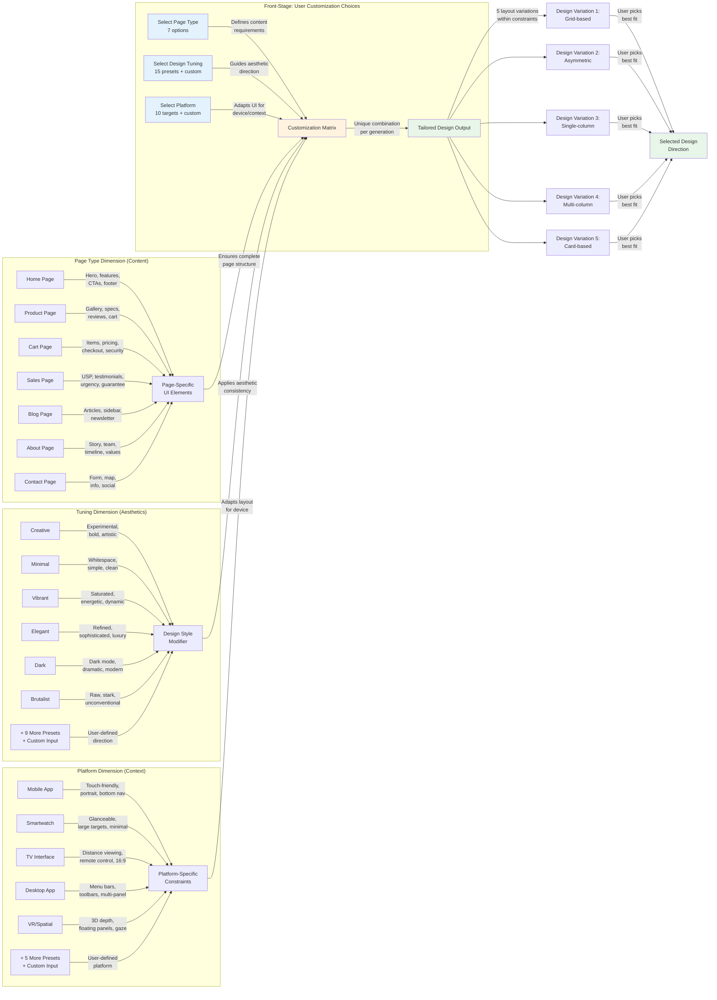

# Customization System

**Type:** Feature Diagram
**Last Updated:** 2025-11-05
**Related Files:**
- `src/tuning-presets.ts`
- `src/platform-presets.ts`
- `src/prompt-templates.ts`
- `src/index.ts`

## Purpose

Demonstrates how the three-dimensional customization system (Page Type × Tuning × Platform) enables users to generate precisely targeted design variations without needing design expertise.

## Diagram

## Key Insights

**User Impact:**
- **7 × 15 × 10 = 1,050 possible preset combinations** before considering custom inputs
- **Page Type selection** ensures all essential UI elements are included automatically
- **Tuning presets** let non-designers apply professional aesthetic directions consistently
- **Platform presets** handle device-specific constraints (touch targets, viewing distance, etc.)
- **5 layout variations** per generation provide structural diversity within the chosen direction
- **Custom inputs** for tuning and platform support unlimited user-defined scenarios

**Customization Strategy:**
- **Hierarchical application:** Page Type → Platform → Tuning → Layout → Presentation
- **Preset system reduces cognitive load:** Users select from curated options instead of describing from scratch
- **Custom fallback:** Any string not matching a preset becomes a custom modifier
- **Randomization for variety:** When no tuning specified, system randomizes DESIGN_STYLES
- **Consistent naming:** File names encode all customization choices for easy retrieval

**Technical Implementation:**
- `getTuningPromptModifier()` looks up preset or passes through custom string
- `getPlatformPromptModifier()` looks up preset or passes through custom string
- `buildPrompt()` conditionally includes modifiers in final prompt
- Layout approaches change based on whether tuning is specified
- Presentation formats randomized independently for additional variety

**Design Principles:**
- **Separation of dimensions:** Page, tuning, and platform are orthogonal concerns
- **Progressive disclosure:** Users can start simple (just page type) and add complexity
- **Sensible defaults:** Website platform and no tuning provide neutral baseline
- **Extensibility:** New presets added by updating configuration objects

## Change History

- **2025-11-05:** Initial diagram created showing customization system with DDD principles
