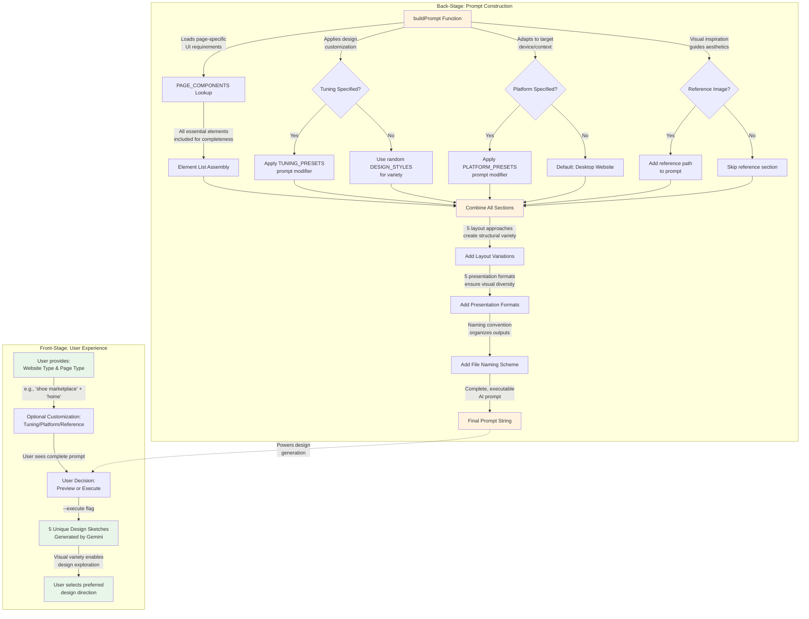

# Prompt Generation Flow

**Type:** Feature Diagram
**Last Updated:** 2025-11-05
**Related Files:**
- `src/prompt-templates.ts`
- `src/tuning-presets.ts`
- `src/platform-presets.ts`
- `src/index.ts`

## Purpose

Illustrates how user inputs are transformed into a comprehensive AI prompt that generates diverse website design sketches, enabling users to receive 5 unique design variations tailored to their specific needs.

## Diagram

## Key Insights

**User Impact:**
- Users get **5 completely different design variations** from a single prompt, accelerating design exploration
- **Tuning presets** (15 options) let users quickly apply consistent aesthetic directions without design expertise
- **Platform presets** (10 options) automatically adapt designs for mobile, watch, TV, VR, etc.
- **Reference images** enable users to communicate visual preferences when words fall short
- **File naming convention** automatically organizes outputs by type, platform, tuning, and timestamp

**Technical Enablers:**
- `buildPrompt()` orchestrates 7 distinct sections into a cohesive AI prompt
- **PAGE_COMPONENTS** ensures all page-appropriate UI elements are included
- **Randomization** of design styles and presentation formats creates natural variety
- **Conditional logic** adapts prompt structure based on user customization choices
- **Modifier system** allows both preset and custom tuning/platform directions

## Change History

- **2025-11-05:** Initial diagram created showing prompt generation flow with DDD principles
