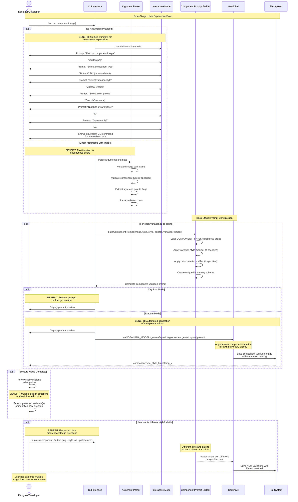

# Component Variation Creation Journey

**Type:** Sequence Diagram
**Last Updated:** 2025-11-07
**Related Files:**
- `src/component.ts`
- `src/component-types.ts`
- `src/variation-presets.ts`
- `src/color-palettes.ts`

## Purpose

Shows the complete user journey for generating UI component variations from a reference image, highlighting how the tool enables rapid design exploration without requiring design expertise.

## Diagram

## Key Insights

**User Impact:**
- **Reference-based approach** enables users to iterate on existing designs rather than start from scratch
- **Component type selection** ensures AI focuses on appropriate design considerations (e.g., touch targets for buttons)
- **20+ variation style presets** provide instant access to different design systems (Material, iOS, Glassmorphism, etc.)
- **20+ color palette presets** enable rapid color scheme exploration with developer-friendly themes
- **Configurable variation count** allows users to generate as many or as few options as needed
- **Dry run mode** prevents wasted AI credits when experimenting with prompt parameters
- **Structured file naming** makes it easy to track which style/palette produced which variation

**Technical Enablers:**
- `buildComponentPrompt()` constructs focused prompts emphasizing component-specific design considerations
- **COMPONENT_TYPES** provides 15 component definitions with type-specific focus areas
- **VARIATION_PRESETS** offers 20 style presets with detailed design system instructions
- **COLOR_PALETTES** includes 20+ curated color schemes with specific color codes
- **Reference image path** passed directly to Gemini for visual context
- **Unique identifiers** in prompts ensure Gemini generates distinct files per variation

**Error Recovery:**
- Invalid image paths detected before generation begins
- Invalid component types show list of valid options
- Missing required arguments trigger comprehensive help display
- Gemini failures return exit codes with error context
- File system errors from Gemini visible in stderr

**Workflow Flexibility:**
- Start with any existing component screenshot or mockup
- Auto-detect component type or specify explicitly for better focus
- Mix and match styles with color palettes for unique combinations
- Generate 1 variation for quick tests or 10+ for comprehensive exploration
- Interactive mode teaches CLI syntax for future automation

## Change History

- **2025-11-07:** Initial diagram created for component variation feature
