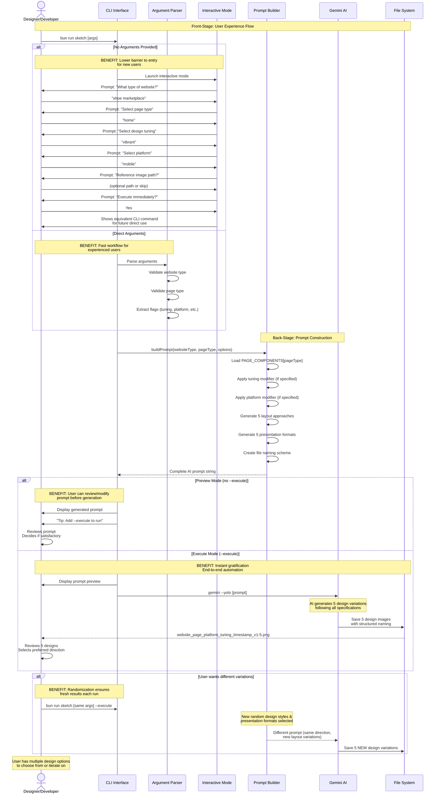

# User Design Creation Journey

**Type:** Sequence Diagram
**Last Updated:** 2025-11-05
**Related Files:**
- `src/index.ts`
- `src/prompt-templates.ts`

## Purpose

Shows the complete user journey from initial concept to generated design sketches, highlighting how the tool reduces friction in the design ideation process and enables rapid iteration.

## Diagram

## Key Insights

**User Impact:**
- **Two interaction modes** support both beginners (interactive) and power users (direct CLI)
- **Interactive mode shows equivalent CLI command** to teach users the direct syntax
- **Preview mode** lets users validate the prompt before spending AI credits
- **Execute mode** provides end-to-end automation for experienced users
- **Randomization** ensures running the same command twice produces fresh design variations
- **Structured file naming** makes it easy to find and compare design variations later

**Technical Enablers:**
- `parseArgs()` validates all inputs before proceeding
- Interactive mode uses `@inquirer/prompts` for user-friendly input collection
- `buildPrompt()` encapsulates all prompt generation logic
- `Bun.spawn()` executes Gemini CLI with proper process handling
- Error handling provides clear feedback when Gemini fails

**Error Recovery:**
- Invalid page types show list of valid options
- Missing required arguments trigger help display
- Gemini failures return exit codes to the user
- File system errors from Gemini are visible in stderr

## Change History

- **2025-11-05:** Initial diagram created showing user journey with DDD principles
